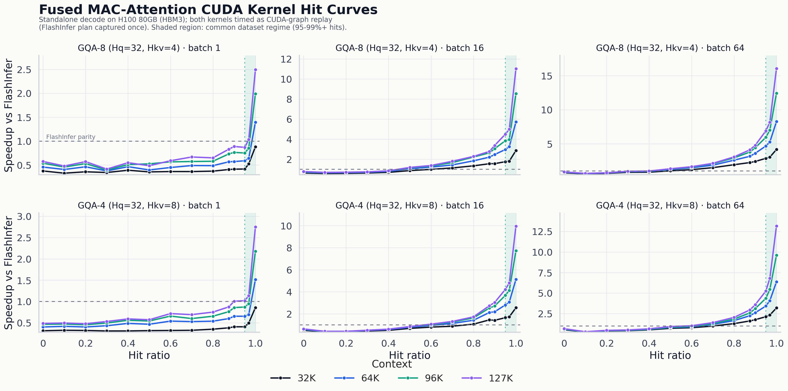

#  MAC-Attention

[](https://arxiv.org/abs/2604.00235)
[](https://mlsys.org/)
[](https://github.com/sgl-project/sglang)
[](#requirements)

**MAC-Attention** is a high-performance long-context decode path that reuses
attention computation across semantically similar tokens.

It implements the **Match-Amend-Complete** attention scheme from
[MAC-Attention: a Match-Amend-Complete Scheme for Fast and Accurate Attention Computation](https://arxiv.org/abs/2604.00235),
accepted at **MLSys 2026**.

<p align="center">
  
</p>

## Why MAC-Attention?

Long-context decoding is often dominated by repeatedly reading the growing KV
cache. MAC-Attention accelerates this path by finding semantically similar
recent queries, reusing their cached prefix attention state, recomputing only the
needed correction and tail regions, and merging attention states with a stable
log-sum-exp reduction.

This repository provides:

- A fused persistent **BF16 CUDA decode kernel** with in-kernel matching,
  scheduling, partial attention, merge, and MAC cache update.
- A portable **SGLang plugin** that installs runtime hooks without patching
  SGLang source files.
- Correctness checks and reproducible MAC-vs-FlashInfer hit-curve benchmarks.

## Current Status

| Area | Status |
| --- | --- |
| Main serving path | SGLang + FlashInfer backend + portable runtime hooks |
| Kernel path | Fused persistent BF16 decode kernel: `mac_persistent_decode_bf16` (GQA groups up to 8; dedicated block-256 path for GQA-8 shapes such as Qwen3-30B) |
| Benchmark mode | CUDA graph enabled; both kernels timed as graph replay (`--cuda-graph`) |
| Validation target | NVIDIA BF16 GPU; current validation target is H100-class hardware |
| Model coverage | Primarily validated on the Llama 3.1 family; runtime hooks also cover Qwen2/Qwen3 MoE attention (e.g. Qwen3-30B) |
| Unsupported configurations | Use the normal SGLang/FlashInfer path |

> The result below times the fused MAC-Attention CUDA decode kernel and
> the FlashInfer baseline as CUDA-graph replay on H100 80GB (HBM3), for the
> GQA-8 (Qwen3-30B shape) and GQA-4 head layouts at batch 1, 16, and 64. Practical
> long-context workloads usually operate in the high-hit region, so the figure
> highlights hit ratios where MAC-Attention is expected to be useful.

<p align="center">
  
</p>

## Release Notes (2026-07 kernel update)

This update replaces the decode kernel and SGLang hooks with the latest
optimized lineage:

- **Kernel performance rework.** Rewritten in-kernel match scan (vectorized
  paired-slot probes with an exact lower-bound pass), a unified dynamic
  shared-memory pool (higher SM occupancy), a deeper `cp.async` staging ring,
  and wave-quantized fallback/tail scheduling.
- **GQA-8 support.** A dedicated block-256 kernel path for 8-way GQA groups
  (e.g. Qwen3-30B, `Hq=32`/`Hkv=4`), alongside the existing block-128 path for
  groups up to 4.
- **Front-sink exclusion.** `MAC_FRONT_SINK_TOKENS=F` keeps the first `F`
  context tokens out of reused prefix state and recomputes them exactly on
  every MAC hit (see [How It Works](#how-it-works)).
- **CUDA-graph-safe readiness gating.** Per-request device-side ready/epoch
  state lets the persistent kernel demote requests with pending or invalidated
  MAC caches to exact full attention inside a captured graph, and MAC refuses
  to be baked into a graph when the model context exceeds the persistent
  workspace (`MAC_PERSISTENT_MAX_CONTEXT`).
- **Qwen2/Qwen3 MoE hooks.** Model-side hooks now cover Qwen2/Qwen3 MoE
  attention in addition to Llama.
- **Opt-in decode audit.** `MAC_WORKFLOW_AUDIT=1` re-runs exact FlashInfer
  after each MAC decode and records error statistics (diagnostic only — never
  for performance measurement).
- **CUDA graphs on by default.** The portable serving env and launch wrapper
  now keep SGLang CUDA graphs enabled (`MAC_DISABLE_CUDA_GRAPH=0`), and the
  benchmark times graph replay on both sides via the new `--cuda-graph`
  mode of `bench_mac_vs_flashinfer_direct.py`.

**Breaking changes** for direct callers of the JIT extensions (the bundled
hooks, tools, and benchmarks are already updated; SGLang users rebuild
automatically via `torch.utils.cpp_extension`):

- `mac_persistent_decode_bf16` adds `front_sink_tokens` plus trailing
  `query_post_cache`, `mac_cache_ready`, `mac_cache_epoch`, and
  `mac_request_epoch` arguments (pass empty tensors to opt out of the
  readiness gate).
- `mac_prefill_update_cache` adds a trailing `q_post_cache` argument.

The updated kernel was checked against the previous reference implementation
on an 853-case matrix (contexts up to 127K, GQA 4/8, front sink 0/64/128, hit
fractions 0–1, direct CUDA-graph replay) with identical match/hit decisions
and outputs within an FP32-oracle tolerance of 1e-2 relative L2. The committed
hit-curve figure and CSVs under `results/` are measured with this kernel on
H100 80GB (HBM3) under CUDA-graph replay on both sides (new `--cuda-graph`
benchmark mode): GQA-8 and GQA-4, batch 1, 16, and 64, contexts 32K–127K.

## Contents

- [Release Notes (2026-07 kernel update)](#release-notes-2026-07-kernel-update)
- [Requirements](#requirements)
- [Quick Start](#quick-start)
- [Run SGLang with MAC-Attention](#run-sglang-with-mac-attention)
- [Verify Installation](#verify-installation)
- [Benchmarks](#benchmarks)
- [Runtime Configuration](#runtime-configuration)
- [How It Works](#how-it-works)
- [SGLang Integration Flow](#sglang-integration-flow)
- [Build and JIT Compilation](#build-and-jit-compilation)
- [Project Layout](#project-layout)
- [Troubleshooting](#troubleshooting)
- [Roadmap](#roadmap)
- [Citation](#citation)

## Requirements

| Dependency | Requirement |
| --- | --- |
| Python | Python >=3.10 |
| GPU | NVIDIA GPU with BF16 support; H100-class hardware is the current validation target |
| CUDA/PyTorch | CUDA-enabled PyTorch environment; current SGLang validation uses CUDA 13.0 |
| Attention backend | `flashinfer-python` for FlashInfer baselines and SGLang's FlashInfer backend |
| Serving framework | Official SGLang checkout; the current hooks are validated against SGLang commit `784fe7e99` (0.5.13.dev84)|
| Model | A BF16 model path compatible with the selected SGLang setup |

## Quick Start

Clone SGLang and MAC-Attention, then install both in editable mode:

```bash
git clone https://github.com/sgl-project/sglang.git
git clone https://github.com/YJHMITWEB/MAC-Attention.git

export SGLANG_ROOT="$PWD/sglang"
export MAC_ATTENTION_REPO_ROOT="$PWD/MAC-Attention"

python -m pip install -U pip
python -m pip install -e "$SGLANG_ROOT/python"
python -m pip install -e "$MAC_ATTENTION_REPO_ROOT"
python -m pip install flashinfer-python
```

Load the portable plugin defaults:

```bash
source "$MAC_ATTENTION_REPO_ROOT/portable_plugin_repro/env_mac_portable.sh"
```

Check that PyTorch and MAC-Attention are importable:

```bash
python - <<'PY'
import torch
import mac_attention

print("torch:", torch.__version__)
print("cuda:", torch.version.cuda)
print("cuda_available:", torch.cuda.is_available())
print("mac_attention:", mac_attention.__file__)
PY
```

## Run SGLang with MAC-Attention

Set the model path and launch through the portable wrapper:

```bash
export MODEL_PATH=<path-to-model>
export CUDA_VISIBLE_DEVICES=0
export MAC_DISABLE_CUDA_GRAPH=0

"$MAC_ATTENTION_REPO_ROOT/portable_plugin_repro/run_sglang_mac_server.sh" \
  --host 0.0.0.0
```

The wrapper launches:

```bash
python -m mac_attention.integrations.sglang.launch_server \
  --model-path "$MODEL_PATH" \
  --attention-backend flashinfer \
  --trust-remote-code \
  --disable-radix-cache \
  --page-size 1 \
  --chunked-prefill-size "${CHUNKED_PREFILL_SIZE:-8192}" \
  --port "${PORT:-18543}"
```

CUDA graphs stay enabled by default. Setting `MAC_DISABLE_CUDA_GRAPH=1` makes
the wrapper add `--disable-cuda-graph`, which is useful for debugging only.

For a plain FlashInfer baseline, launch official SGLang directly with the same
model and serving arguments, but without the MAC-Attention wrapper or MAC
runtime environment variables.

## Verify Installation

Check that MAC-Attention can install the SGLang hooks without launching a
server:

```bash
"$MAC_ATTENTION_REPO_ROOT/portable_plugin_repro/run_hook_check.sh"
```

Run the CUDA kernel and plugin correctness checks:

```bash
"$MAC_ATTENTION_REPO_ROOT/portable_plugin_repro/run_correctness.sh"
```

Run the fused decode checker directly:

```bash
cd "$MAC_ATTENTION_REPO_ROOT"
PYTHONPATH=attention/src python attention/tools/check_mac_persistent_decode.py
```

## Benchmarks

### Reproduce the MAC-vs-FlashInfer hit curve

The benchmark sweeps batch **1**, **16**, and **64** at context lengths **32K**,
**64K**, **96K**, and **127K**, with hit ratios from **0.0** to **1.0**, for
the GQA-8 (`Hq=32`, `Hkv=4`) and GQA-4 (`Hq=32`, `Hkv=8`) head layouts. Both
kernels are captured into CUDA graphs and timed as graph replay.

```bash
cd "$MAC_ATTENTION_REPO_ROOT"

OUT_DIR="$MAC_ATTENTION_REPO_ROOT/results/repro_cuda_graph_hit_curves" \
  "$MAC_ATTENTION_REPO_ROOT/portable_plugin_repro/run_standalone_full_curve.sh"
```

The wrapper runs, once per head layout (`--hq 32 --hkv 4` and `--hq 32 --hkv 8`):

```bash
python benchmark/bench_mac_vs_flashinfer_direct.py \
  --contexts "32768,65536,98304,126976" \
  --batch "1,16,64" \
  --hit-rates "0,0.1,0.2,0.3,0.4,0.5,0.6,0.7,0.8,0.875,0.9,0.95,0.96875,1.0" \
  --bench-mode synthetic_head \
  --cuda-graph \
  --warmup 12 \
  --iters 60 \
  --flashinfer-baseline-timing plan_run_wall \
  --partial-fp32 \
  --csv "$OUT_DIR/gqa8.csv"   # gqa4.csv for the second layout
```

Committed benchmark artifacts:

| File | Purpose |
| --- | --- |
| `results/cuda_graph_hit_curves/gqa8.csv` | GQA-8 source data for the README figure |
| `results/cuda_graph_hit_curves/gqa4.csv` | GQA-4 source data for the README figure |
| `assets/perf_update_20260717/cuda_graph_hit_curves.png` | Rendered PNG figure |
| `assets/perf_update_20260717/cuda_graph_hit_curves.svg` | Rendered SVG figure |

Regenerate the figure:

```bash
python -m pip install matplotlib seaborn pandas
python plot_portable_plugin_results.py
```

### Run a MAC-only persistent decode microbenchmark

```bash
cd "$MAC_ATTENTION_REPO_ROOT"
PYTHONPATH=attention/src python attention/tools/bench_mac_persistent_decode.py \
  --kv-len 65536 73728 98304 126976 \
  --batch 1 \
  --bench-mode synthetic_head \
  --bench-hit-rate 0.95 \
  --warmup 12 \
  --iters 60 \
  --partial-fp32 \
  --csv results/mac_only_persistent_decode.csv
```

## Runtime Configuration

The portable defaults are set by:

```bash
source "$MAC_ATTENTION_REPO_ROOT/portable_plugin_repro/env_mac_portable.sh"
```

Recommended settings:

```bash
export MAC_ATTENTION_ENABLE=1
export MAC_ATTENTION_PORTABLE_PLUGIN=1
export MAC_ATTENTION_SGLANG_STRICT=1
export MAC_DISABLE_CUDA_GRAPH=0

export MAC_THRESHOLD=0.45
export MAC_LOOKBACK_TOKENS_LEFT=512
export MAC_LOOKBACK_TOKENS_RIGHT=0
export MAC_GEN_MIN_LIMIT=2048
export MAC_SEMANTIC_POS_AHEAD=256

export MAC_PERSISTENT_PARALLEL_Z2_SCHEDULE=1
export MAC_PERSISTENT_MIXED_MISSPACK_Z2=1
export MAC_FUSE_HIT_TAIL_IN_MERGE=0
export MAC_PERSISTENT_PARTIAL_FP32=1
export MAC_USE_FUSED_KV_ROPE=1
export MAC_USE_FUSED_Q_PRESERVE_ROPE=1
```

### Integration flags

| Variable | Meaning |
| --- | --- |
| `MAC_ATTENTION_ENABLE` | Enables MAC-Attention in the SGLang hook path |
| `MAC_ATTENTION_PORTABLE_PLUGIN` | Uses the portable runtime plugin instead of source-file patches |
| `MAC_ATTENTION_SGLANG_STRICT` | Fails fast if expected SGLang hook points are missing |
| `MAC_DISABLE_CUDA_GRAPH` | `0` (default) keeps SGLang CUDA graphs enabled; `1` disables capture for debugging |

### Matching and cache flags

| Variable | Meaning |
| --- | --- |
| `MAC_THRESHOLD` | Semantic query-match threshold |
| `MAC_LOOKBACK_TOKENS_LEFT` | Number of ring-cache rows searched for matching |
| `MAC_LOOKBACK_TOKENS_RIGHT` | Right-side lookback window; currently `0` in the setup |
| `MAC_GEN_MIN_LIMIT` | Minimum generated/context length before MAC decode is attempted |
| `MAC_SEMANTIC_POS_AHEAD` | Rectification band used by fused decode cache updates |
| `MAC_FRONT_SINK_TOKENS` | Number of front-of-context tokens excluded from reused prefix state and recomputed exactly on every MAC hit; `0` (default) preserves band-only rectification |

### Kernel scheduling flags

| Variable | Meaning |
| --- | --- |
| `MAC_PERSISTENT_PARALLEL_Z2_SCHEDULE` | Enables the current parallel persistent scheduling path |
| `MAC_PERSISTENT_MIXED_MISSPACK_Z2` | Enables the mixed-hit/miss scheduling path used by the committed benchmark |
| `MAC_FUSE_HIT_TAIL_IN_MERGE` | Controls whether hit-tail work is fused into the merge path |
| `MAC_PERSISTENT_PARTIAL_FP32` | Uses FP32 partial-output workspaces for partial attention paths |
| `MAC_USE_FUSED_KV_ROPE` | Enables the fused KV RoPE helper in the SGLang integration |
| `MAC_USE_FUSED_Q_PRESERVE_ROPE` | Enables the fused query-preservation RoPE helper |
| `MAC_PERSISTENT_BLOCK_THREADS` | Kernel block size; defaults to `256` for GQA groups above 4 and `128` otherwise |
| `MAC_PERSISTENT_TAIL_TILE_TOKENS` | Separate tile granularity for tail attention work; `0` (default) uses the main tile size |
| `MAC_PERSISTENT_TAIL_PREPASS` | Streams tail tiles concurrently with the match scan; default `0` (measured neutral-to-negative on H100, kept for experimentation) |
| `MAC_PERSISTENT_TASK_OVERHEAD_TOKENS` | Per-task overhead weight used by wave-quantized fallback chunk sizing; default `128` |

Many additional expert scheduling knobs exist in
`mac_decode_persistent.cu` with tuned defaults; the recommended settings above
are the supported configuration.

### Serving and workspace flags

| Variable | Meaning |
| --- | --- |
| `MAC_PERSISTENT_MAX_CONTEXT` | Persistent-kernel workspace sizing bound (default `131072` tokens). Models whose context exceeds it fall back to FlashInfer, and MAC is never captured into a CUDA graph beyond it |
| `MAC_ASYNC_CACHE_UPDATE_SLOTS` | Number of async prefill cache-update staging slots; lower it (e.g. `1`) to bound workspace memory on memory-tight deployments |
| `MAC_ACTIVE_REQUEST_CAPACITY_ONLY` | Sizes MAC caches by active requests instead of the scheduler's maximum; default `0` |

### Diagnostics flags

| Variable | Meaning |
| --- | --- |
| `MAC_WORKFLOW_AUDIT` | Opt-in research audit: re-runs exact FlashInfer after each MAC decode and records per-step error statistics (JSONL). Adds large overhead — never use while measuring performance |
| `MAC_WORKFLOW_AUDIT_DIR` / `_LAYERS` / `_MAX_RECORDS` / `_MIN_PAST_LEN` / `_MAX_PAST_LEN` / `_PAST_STRIDE` / `_NO_RECT` | Audit output location, layer filter, record caps, and sampling controls |
| `MAC_PERSISTENT_DEBUG_LAUNCH` | Prints the resolved kernel launch configuration once at first launch |

## How It Works

For each decode query, MAC-Attention:

1. Searches a bounded query cache for a semantically similar previous query.
2. Reuses the cached prefix attention state from the matched query.
3. Recomputes a small rectification band near the match boundary.
4. Computes attention over the new KV tail.
5. Merges reused and newly computed attention states with a numerically stable
   log-sum-exp merge.
6. Writes the output and updates the MAC query, attention, and LSE caches for
   future decode steps.

When `MAC_FRONT_SINK_TOKENS=F` with `F > 0`, the first `F` context tokens
(attention sinks) are excluded from stored prefix state by construction: sink
attention is recomputed exactly on every hit and merged output-only, so ring
cache entries cover exactly the non-sink prefix and reuse can never carry
stale sink contributions across steps.

The current implementation keeps the paper's math but organizes the decode path
as a single fused persistent BF16 CUDA kernel, `mac_persistent_decode_bf16`. The
kernel performs:

- In-kernel query-cache matching over the MAC lookback window.
- Per-head and per-GQA-group hit/miss classification.
- Load scheduling for hit, miss, and mixed groups.
- Partial full-KV, rectification, and tail attention work.
- Stable log-sum-exp merge of reused and newly computed attention states.
- Output writeback plus MAC query/attention/LSE cache update for the next token.

The older `0.1.0` reference release exposed these stages separately: a
standalone ring-match extension, MAC decode wrappers around FlashInfer-style
paged-KV attention, and separate cache update paths. The current production path
fuses these stages to reduce host-side orchestration in the token decode hot
path.

## SGLang Integration Flow

MAC-Attention integrates with SGLang through runtime hooks in
`mac_attention.integrations.sglang`.

Official SGLang remains responsible for:

- Model execution.
- Request scheduling.
- Paged KV allocation.
- FlashInfer backend integration.

MAC-Attention hooks handle:

- Preserving model query state before decode.
- Maintaining MAC ring caches.
- Intercepting supported BF16 paged-KV decode calls.
- Launching the fused persistent MAC decode kernel.
- Tracking per-request cache readiness and epochs on device, so requests with
  pending or invalidated MAC caches run exact full attention even under CUDA
  graph replay, where Python-side gating cannot run per step.
- Falling back to the normal SGLang/FlashInfer path when MAC is disabled or the
  request is outside the supported configuration.

The SGLang integration JIT-loads CUDA sources under
`attention/src/mac_attention/integrations/sglang/csrc/`:

| File | Role |
| --- | --- |
| `mac_decode_persistent.cu` | Main fused MAC decode kernel used on the production decode path and hit-curve benchmarks |
| `mac_decode_rope_preserve.cu` | Fused RoPE/query-preservation helper used before decode |
| `mac_merge_downdate_cache.cu` | Prefill cache merge/update-downdate helper |
| `mac_prefill_update_cache.cu` | Prefill cache update helper |

## Build and JIT Compilation

CUDA kernels are built on demand through `torch.utils.cpp_extension`. The first
correctness run, benchmark run, or SGLang decode that reaches the MAC path will
compile the extension from:

```text
attention/src/mac_attention/integrations/sglang/csrc/
```

The portable environment script keeps build products inside the repository by
default:

```bash
source portable_plugin_repro/env_mac_portable.sh
echo "$TORCH_EXTENSIONS_DIR"
```

Useful build knobs:

```bash
export MAC_WORKSPACE_BASE="$MAC_ATTENTION_REPO_ROOT/attention"
export TORCH_EXTENSIONS_DIR="$MAC_ATTENTION_REPO_ROOT/attention/.torch_extensions"
export TVM_FFI_GPU_BACKEND=cuda
```

Force a clean rebuild:

```bash
rm -rf "$MAC_ATTENTION_REPO_ROOT/attention/.torch_extensions"
```

## Project Layout

```text
MAC-Attention/
├── README.md
├── pyproject.toml
├── attention/
│   ├── src/mac_attention/
│   │   └── integrations/sglang/
│   │       ├── bridge.py                # JIT loader for CUDA extensions
│   │       ├── config.py                # Env and CLI config for SGLang hooks
│   │       ├── hook_installer.py        # Runtime hook entry point
│   │       ├── launch_server.py         # SGLang launch wrapper
│   │       ├── plugin.py                # SGLang plugin entry point
│   │       ├── flashinfer_hooks.py      # FlashInfer decode hook integration
│   │       ├── llama_hooks.py           # Model-side query/cache hooks
│   │       ├── cuda_graph_hooks.py      # CUDA graph compatibility hooks
│   │       ├── schedule_hooks.py        # Decode scheduling hooks
│   │       ├── profiling.py             # Lightweight MAC profiling helpers
│   │       └── csrc/
│   │           ├── mac_decode_persistent.cu
│   │           ├── mac_decode_rope_preserve.cu
│   │           ├── mac_merge_downdate_cache.cu
│   │           └── mac_prefill_update_cache.cu
│   ├── tests/
│   │   ├── test_mac_persistent_decode.py
│   │   ├── test_sglang_plugin_config.py
│   │   └── test_sglang_q_preserve.py
│   └── tools/
│       ├── bench_mac_persistent_decode.py
│       ├── check_front_sink_recurrence.py
│       ├── check_mac_persistent_decode.py
│       └── profile_mac_persistent_decode.py
├── benchmark/
│   └── bench_mac_vs_flashinfer_direct.py
├── portable_plugin_repro/
│   ├── env_mac_portable.sh
│   ├── run_correctness.sh
│   ├── run_hook_check.sh
│   ├── run_sglang_mac_server.sh
│   └── run_standalone_full_curve.sh
├── results/
│   └── cuda_graph_hit_curves/ (gqa8.csv, gqa4.csv)
├── assets/perf_update_20260717/
│   ├── cuda_graph_hit_curves.png
│   └── cuda_graph_hit_curves.svg
└── plot_portable_plugin_results.py
```

## Troubleshooting

### First run is slow

The first run may JIT-compile CUDA extensions. This is expected. Build artifacts
are stored under `attention/.torch_extensions` by default when the portable
environment script is sourced.

### MAC hooks are not active

Check that the portable environment is loaded and that these variables are set:

```bash
echo "$PYTHONPATH"
echo "$MAC_ATTENTION_ENABLE"
echo "$MAC_ATTENTION_PORTABLE_PLUGIN"
echo "$MAC_ATTENTION_SGLANG_STRICT"
```

Then run:

```bash
"$MAC_ATTENTION_REPO_ROOT/portable_plugin_repro/run_hook_check.sh"
```

### CUDA extension build fails

Try a clean rebuild:

```bash
rm -rf "$MAC_ATTENTION_REPO_ROOT/attention/.torch_extensions"
source "$MAC_ATTENTION_REPO_ROOT/portable_plugin_repro/env_mac_portable.sh"
"$MAC_ATTENTION_REPO_ROOT/portable_plugin_repro/run_correctness.sh"
```

Also verify that the active PyTorch build, CUDA toolkit, and GPU architecture are
compatible with your environment.

### Performance does not match the curve

The committed figure times CUDA-graph replay on both sides (`--cuda-graph`),
batch sizes `1`, `16`, and `64`, synthetic head benchmark mode, context lengths
32K--127K, and the hit-rate sweep shown in [Benchmarks](#benchmarks), on H100
80GB (HBM3). Eager (non-graph) runs include per-step launch and FlashInfer
plan overhead and will not match it.

## Roadmap

- [ ] **End-to-end serving benchmarks.** The kernel hit curves are measured
  under CUDA-graph replay; a documented end-to-end SGLang serving comparison
  (throughput and latency) is still to be published.
- [ ] **Model quality reporting.** Add end-to-end quality numbers beside
  latency results, including exact evaluation settings and reference outputs.
- [ ] **Model coverage.** Broaden validation beyond the current Llama 3.1-family
  path, including additional recent long-context model families.

## Citation

```bibtex
@misc{yao2026macattention,
  title         = {MAC-Attention: a Match-Amend-Complete Scheme for Fast and Accurate Attention Computation},
  author        = {Jinghan Yao and Sam {Ad\'{e}} Jacobs and Walid Krichene and Masahiro Tanaka and Dhabaleswar K. Panda},
  year          = {2026},
  eprint        = {2604.00235},
  archivePrefix = {arXiv},
  primaryClass  = {cs.LG},
  doi           = {10.48550/arXiv.2604.00235}
}
```
