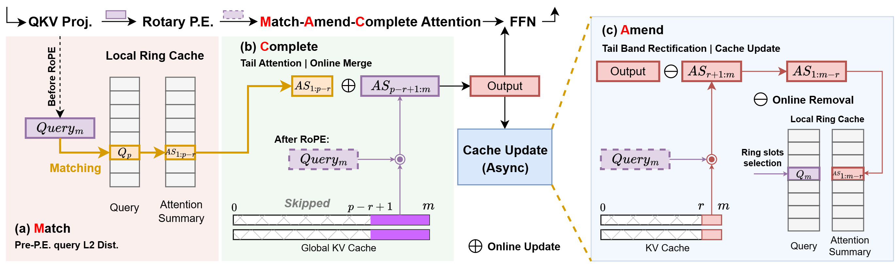
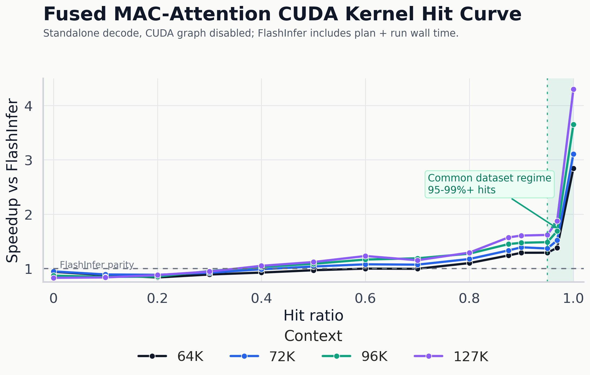

#  MAC-Attention

[](https://arxiv.org/abs/2604.00235)
[](https://mlsys.org/)
[](https://github.com/sgl-project/sglang)
[](#requirements)

**MAC-Attention** is a high-performance long-context decode path that reuses
attention computation across semantically similar tokens.

It implements the **Match-Amend-Complete** attention scheme from
[MAC-Attention: a Match-Amend-Complete Scheme for Fast and Accurate Attention Computation](https://arxiv.org/abs/2604.00235),
accepted at **MLSys 2026**.

<p align="center">
  
</p>

## Why MAC-Attention?

Long-context decoding is often dominated by repeatedly reading the growing KV
cache. MAC-Attention accelerates this path by finding semantically similar
recent queries, reusing their cached prefix attention state, recomputing only the
needed correction and tail regions, and merging attention states with a stable
log-sum-exp reduction.

This repository provides:

- A fused persistent **BF16 CUDA decode kernel** with in-kernel matching,
  scheduling, partial attention, merge, and MAC cache update.
- A portable **SGLang plugin** that installs runtime hooks without patching
  SGLang source files.
- Correctness checks and reproducible MAC-vs-FlashInfer hit-curve benchmarks.

## Current Status

| Area | Status |
| --- | --- |
| Main serving path | SGLang + FlashInfer backend + portable runtime hooks |
| Kernel path | Fused persistent BF16 decode kernel: `mac_persistent_decode_bf16` |
| Public benchmark mode | CUDA graph disabled: `MAC_DISABLE_CUDA_GRAPH=1` |
| Validation target | NVIDIA BF16 GPU; current validation target is H100-class hardware |
| Model coverage | Primarily validated on the Llama 3.1 family |
| Unsupported configurations | Use the normal SGLang/FlashInfer path |

> The public result below focuses on the fused MAC-Attention CUDA decode kernel
> with CUDA graph disabled. Practical long-context workloads usually operate in
> the high-hit region, so the figure highlights hit ratios where MAC-Attention is
> expected to be useful.

<p align="center">
  
</p>

## Contents

- [Requirements](#requirements)
- [Quick Start](#quick-start)
- [Run SGLang with MAC-Attention](#run-sglang-with-mac-attention)
- [Verify Installation](#verify-installation)
- [Benchmarks](#benchmarks)
- [Runtime Configuration](#runtime-configuration)
- [How It Works](#how-it-works)
- [SGLang Integration Flow](#sglang-integration-flow)
- [Build and JIT Compilation](#build-and-jit-compilation)
- [Project Layout](#project-layout)
- [Troubleshooting](#troubleshooting)
- [Roadmap](#roadmap)
- [Citation](#citation)

## Requirements

| Dependency | Requirement |
| --- | --- |
| GPU | NVIDIA GPU with BF16 support; H100-class hardware is the current validation target |
| CUDA/PyTorch | CUDA-enabled PyTorch environment; current SGLang validation uses CUDA 13.0 |
| Attention backend | `flashinfer-python` for FlashInfer baselines and SGLang's FlashInfer backend |
| Serving framework | Official SGLang checkout |
| Model | A BF16 model path compatible with the selected SGLang setup |

## Quick Start

Clone SGLang and MAC-Attention, then install both in editable mode:

```bash
git clone https://github.com/sgl-project/sglang.git
git clone https://github.com/YJHMITWEB/MAC-Attention.git

export SGLANG_ROOT="$PWD/sglang"
export MAC_ATTENTION_REPO_ROOT="$PWD/MAC-Attention"

python -m pip install -U pip
python -m pip install -e "$SGLANG_ROOT/python"
python -m pip install -e "$MAC_ATTENTION_REPO_ROOT"
python -m pip install flashinfer-python
```

Load the portable plugin defaults:

```bash
source "$MAC_ATTENTION_REPO_ROOT/portable_plugin_repro/env_mac_portable.sh"
```

Check that PyTorch and MAC-Attention are importable:

```bash
python - <<'PY'
import torch
import mac_attention

print("torch:", torch.__version__)
print("cuda:", torch.version.cuda)
print("cuda_available:", torch.cuda.is_available())
print("mac_attention:", mac_attention.__file__)
PY
```

## Run SGLang with MAC-Attention

Set the model path and launch through the portable wrapper:

```bash
export MODEL_PATH=<path-to-model>
export CUDA_VISIBLE_DEVICES=0
export MAC_DISABLE_CUDA_GRAPH=1

"$MAC_ATTENTION_REPO_ROOT/portable_plugin_repro/run_sglang_mac_server.sh" \
  --host 0.0.0.0
```

The wrapper launches:

```bash
python -m mac_attention.integrations.sglang.launch_server \
  --model-path "$MODEL_PATH" \
  --attention-backend flashinfer \
  --trust-remote-code \
  --disable-cuda-graph \
  --disable-radix-cache \
  --page-size 1 \
  --chunked-prefill-size "${CHUNKED_PREFILL_SIZE:-8192}" \
  --port "${PORT:-18543}"
```

`--disable-cuda-graph` is added by the wrapper when
`MAC_DISABLE_CUDA_GRAPH=1`, which is the default public benchmark setting.

For a plain FlashInfer baseline, launch official SGLang directly with the same
model and serving arguments, but without the MAC-Attention wrapper or MAC
runtime environment variables.

## Verify Installation

Check that MAC-Attention can install the SGLang hooks without launching a
server:

```bash
"$MAC_ATTENTION_REPO_ROOT/portable_plugin_repro/run_hook_check.sh"
```

Run the CUDA kernel and plugin correctness checks:

```bash
"$MAC_ATTENTION_REPO_ROOT/portable_plugin_repro/run_correctness.sh"
```

Run the fused decode checker directly:

```bash
cd "$MAC_ATTENTION_REPO_ROOT"
PYTHONPATH=attention/src python attention/tools/check_mac_persistent_decode.py
```

## Benchmarks

### Reproduce the public MAC-vs-FlashInfer hit curve

The public benchmark sweeps one request at context lengths **64K**, **72K**,
**96K**, and **127K**, with hit ratios from **0.0** to **1.0**.

```bash
cd "$MAC_ATTENTION_REPO_ROOT"
export MAC_DISABLE_CUDA_GRAPH=1

OUT_DIR="$MAC_ATTENTION_REPO_ROOT/results/repro_no_cuda_graph_hit_curve" \
  "$MAC_ATTENTION_REPO_ROOT/portable_plugin_repro/run_standalone_full_curve.sh"
```

The wrapper runs:

```bash
python benchmark/bench_mac_vs_flashinfer_direct.py \
  --contexts "65536,73728,98304,126976" \
  --batch "1" \
  --hit-rates "0,0.1,0.2,0.3,0.4,0.5,0.6,0.7,0.8,0.875,0.9,0.95,0.96875,1.0" \
  --bench-mode synthetic_head \
  --warmup 12 \
  --iters 60 \
  --flashinfer-baseline-timing plan_run_wall \
  --partial-fp32 \
  --csv "$OUT_DIR/curve.csv"
```

Committed benchmark artifacts:

| File | Purpose |
| --- | --- |
| `results/no_cuda_graph_hit_curve/comparison.csv` | Source data for the README figure |
| `assets/portable_update_20260519/no_cuda_graph_hit_curve.png` | Rendered PNG figure |
| `assets/portable_update_20260519/no_cuda_graph_hit_curve.svg` | Rendered SVG figure |

Regenerate the figure:

```bash
python -m pip install matplotlib seaborn pandas
python plot_portable_plugin_results.py
```

### Run a MAC-only persistent decode microbenchmark

```bash
cd "$MAC_ATTENTION_REPO_ROOT"
PYTHONPATH=attention/src python attention/tools/bench_mac_persistent_decode.py \
  --kv-len 65536 73728 98304 126976 \
  --batch 1 \
  --bench-mode synthetic_head \
  --bench-hit-rate 0.95 \
  --warmup 12 \
  --iters 60 \
  --partial-fp32 \
  --csv results/mac_only_persistent_decode.csv
```

## Runtime Configuration

The portable defaults are set by:

```bash
source "$MAC_ATTENTION_REPO_ROOT/portable_plugin_repro/env_mac_portable.sh"
```

Recommended public-result settings:

```bash
export MAC_ATTENTION_ENABLE=1
export MAC_ATTENTION_PORTABLE_PLUGIN=1
export MAC_ATTENTION_SGLANG_STRICT=1
export MAC_DISABLE_CUDA_GRAPH=1

export MAC_THRESHOLD=0.45
export MAC_LOOKBACK_TOKENS_LEFT=512
export MAC_LOOKBACK_TOKENS_RIGHT=0
export MAC_GEN_MIN_LIMIT=2048
export MAC_SEMANTIC_POS_AHEAD=256

export MAC_PERSISTENT_PARALLEL_Z2_SCHEDULE=1
export MAC_PERSISTENT_MIXED_MISSPACK_Z2=1
export MAC_FUSE_HIT_TAIL_IN_MERGE=0
export MAC_PERSISTENT_PARTIAL_FP32=1
export MAC_USE_FUSED_KV_ROPE=1
export MAC_USE_FUSED_Q_PRESERVE_ROPE=1
```

### Integration flags

| Variable | Meaning |
| --- | --- |
| `MAC_ATTENTION_ENABLE` | Enables MAC-Attention in the SGLang hook path |
| `MAC_ATTENTION_PORTABLE_PLUGIN` | Uses the portable runtime plugin instead of source-file patches |
| `MAC_ATTENTION_SGLANG_STRICT` | Fails fast if expected SGLang hook points are missing |
| `MAC_DISABLE_CUDA_GRAPH` | Disables SGLang CUDA graph capture for the public benchmark path |

### Matching and cache flags

| Variable | Meaning |
| --- | --- |
| `MAC_THRESHOLD` | Semantic query-match threshold |
| `MAC_LOOKBACK_TOKENS_LEFT` | Number of ring-cache rows searched for matching |
| `MAC_LOOKBACK_TOKENS_RIGHT` | Right-side lookback window; currently `0` in the public setup |
| `MAC_GEN_MIN_LIMIT` | Minimum generated/context length before MAC decode is attempted |
| `MAC_SEMANTIC_POS_AHEAD` | Rectification band used by fused decode cache updates |

### Kernel scheduling flags

| Variable | Meaning |
| --- | --- |
| `MAC_PERSISTENT_PARALLEL_Z2_SCHEDULE` | Enables the current parallel persistent scheduling path |
| `MAC_PERSISTENT_MIXED_MISSPACK_Z2` | Enables the mixed-hit/miss scheduling path used by the committed benchmark |
| `MAC_FUSE_HIT_TAIL_IN_MERGE` | Controls whether hit-tail work is fused into the merge path |
| `MAC_PERSISTENT_PARTIAL_FP32` | Uses FP32 partial-output workspaces for partial attention paths |
| `MAC_USE_FUSED_KV_ROPE` | Enables the fused KV RoPE helper in the SGLang integration |
| `MAC_USE_FUSED_Q_PRESERVE_ROPE` | Enables the fused query-preservation RoPE helper |

## How It Works

For each decode query, MAC-Attention:

1. Searches a bounded query cache for a semantically similar previous query.
2. Reuses the cached prefix attention state from the matched query.
3. Recomputes a small rectification band near the match boundary.
4. Computes attention over the new KV tail.
5. Merges reused and newly computed attention states with a numerically stable
   log-sum-exp merge.
6. Writes the output and updates the MAC query, attention, and LSE caches for
   future decode steps.

The current implementation keeps the paper's math but organizes the decode path
as a single fused persistent BF16 CUDA kernel, `mac_persistent_decode_bf16`. The
kernel performs:

- In-kernel query-cache matching over the MAC lookback window.
- Per-head and per-GQA-group hit/miss classification.
- Load scheduling for hit, miss, and mixed groups.
- Partial full-KV, rectification, and tail attention work.
- Stable log-sum-exp merge of reused and newly computed attention states.
- Output writeback plus MAC query/attention/LSE cache update for the next token.

The older `0.1.0` reference release exposed these stages separately: a
standalone ring-match extension, MAC decode wrappers around FlashInfer-style
paged-KV attention, and separate cache update paths. The current production path
fuses these stages to reduce host-side orchestration in the token decode hot
path.

## SGLang Integration Flow

MAC-Attention integrates with SGLang through runtime hooks in
`mac_attention.integrations.sglang`.

Official SGLang remains responsible for:

- Model execution.
- Request scheduling.
- Paged KV allocation.
- FlashInfer backend integration.

MAC-Attention hooks handle:

- Preserving model query state before decode.
- Maintaining MAC ring caches.
- Intercepting supported BF16 paged-KV decode calls.
- Launching the fused persistent MAC decode kernel.
- Falling back to the normal SGLang/FlashInfer path when MAC is disabled or the
  request is outside the supported configuration.

The SGLang integration JIT-loads CUDA sources under
`attention/src/mac_attention/integrations/sglang/csrc/`:

| File | Role |
| --- | --- |
| `mac_decode_persistent.cu` | Main fused MAC decode kernel used on the production decode path and hit-curve benchmarks |
| `mac_decode_rope_preserve.cu` | Fused RoPE/query-preservation helper used before decode |
| `mac_merge_downdate_cache.cu` | Prefill cache merge/update-downdate helper |
| `mac_prefill_update_cache.cu` | Prefill cache update helper |

## Build and JIT Compilation

CUDA kernels are built on demand through `torch.utils.cpp_extension`. The first
correctness run, benchmark run, or SGLang decode that reaches the MAC path will
compile the extension from:

```text
attention/src/mac_attention/integrations/sglang/csrc/
```

The portable environment script keeps build products inside the repository by
default:

```bash
source portable_plugin_repro/env_mac_portable.sh
echo "$TORCH_EXTENSIONS_DIR"
```

Useful build knobs:

```bash
export MAC_WORKSPACE_BASE="$MAC_ATTENTION_REPO_ROOT/attention"
export TORCH_EXTENSIONS_DIR="$MAC_ATTENTION_REPO_ROOT/attention/.torch_extensions"
export TVM_FFI_GPU_BACKEND=cuda
```

Force a clean rebuild:

```bash
rm -rf "$MAC_ATTENTION_REPO_ROOT/attention/.torch_extensions"
```

## Project Layout

```text
MAC-Attention/
├── README.md
├── pyproject.toml
├── attention/
│   ├── src/mac_attention/
│   │   └── integrations/sglang/
│   │       ├── bridge.py                # JIT loader for CUDA extensions
│   │       ├── config.py                # Env and CLI config for SGLang hooks
│   │       ├── hook_installer.py        # Runtime hook entry point
│   │       ├── launch_server.py         # SGLang launch wrapper
│   │       ├── plugin.py                # SGLang plugin entry point
│   │       ├── flashinfer_hooks.py      # FlashInfer decode hook integration
│   │       ├── llama_hooks.py           # Model-side query/cache hooks
│   │       ├── cuda_graph_hooks.py      # CUDA graph compatibility hooks
│   │       ├── schedule_hooks.py        # Decode scheduling hooks
│   │       ├── profiling.py             # Lightweight MAC profiling helpers
│   │       └── csrc/
│   │           ├── mac_decode_persistent.cu
│   │           ├── mac_decode_rope_preserve.cu
│   │           ├── mac_merge_downdate_cache.cu
│   │           └── mac_prefill_update_cache.cu
│   ├── tests/
│   │   ├── test_mac_persistent_decode.py
│   │   ├── test_sglang_plugin_config.py
│   │   └── test_sglang_q_preserve.py
│   └── tools/
│       ├── bench_mac_persistent_decode.py
│       ├── check_mac_persistent_decode.py
│       └── profile_mac_persistent_decode.py
├── benchmark/
│   └── bench_mac_vs_flashinfer_direct.py
├── portable_plugin_repro/
│   ├── env_mac_portable.sh
│   ├── run_correctness.sh
│   ├── run_hook_check.sh
│   ├── run_sglang_mac_server.sh
│   └── run_standalone_full_curve.sh
├── results/
│   └── no_cuda_graph_hit_curve/comparison.csv
├── assets/portable_update_20260519/
│   ├── no_cuda_graph_hit_curve.png
│   └── no_cuda_graph_hit_curve.svg
└── plot_portable_plugin_results.py
```

## Troubleshooting

### First run is slow

The first run may JIT-compile CUDA extensions. This is expected. Build artifacts
are stored under `attention/.torch_extensions` by default when the portable
environment script is sourced.

### MAC hooks are not active

Check that the portable environment is loaded and that these variables are set:

```bash
echo "$PYTHONPATH"
echo "$MAC_ATTENTION_ENABLE"
echo "$MAC_ATTENTION_PORTABLE_PLUGIN"
echo "$MAC_ATTENTION_SGLANG_STRICT"
```

Then run:

```bash
"$MAC_ATTENTION_REPO_ROOT/portable_plugin_repro/run_hook_check.sh"
```

### CUDA extension build fails

Try a clean rebuild:

```bash
rm -rf "$MAC_ATTENTION_REPO_ROOT/attention/.torch_extensions"
source "$MAC_ATTENTION_REPO_ROOT/portable_plugin_repro/env_mac_portable.sh"
"$MAC_ATTENTION_REPO_ROOT/portable_plugin_repro/run_correctness.sh"
```

Also verify that the active PyTorch build, CUDA toolkit, and GPU architecture are
compatible with your environment.

### Performance does not match the public curve

Confirm that CUDA graph is disabled for the public benchmark path:

```bash
echo "$MAC_DISABLE_CUDA_GRAPH"
```

The committed figure uses `MAC_DISABLE_CUDA_GRAPH=1`, batch size `1`, synthetic
head benchmark mode, context lengths 64K--127K, and the hit-rate sweep shown in
[Benchmarks](#benchmarks).

## Roadmap

- [ ] **CUDA graph validation.** The implementation can be configured with
  `MAC_DISABLE_CUDA_GRAPH=0`, but the public benchmark uses CUDA graph disabled.
  CUDA graph performance and reproducibility need a separate documented
  validation pass before publishing those numbers.
- [ ] **Model quality reporting.** Add public end-to-end quality numbers beside
  latency results, including exact evaluation settings and reference outputs.
- [ ] **Model coverage.** Broaden validation beyond the current Llama 3.1-family
  path, including additional recent long-context model families.

## Citation

```bibtex
@misc{yao2026macattention,
  title         = {MAC-Attention: a Match-Amend-Complete Scheme for Fast and Accurate Attention Computation},
  author        = {Jinghan Yao and Sam {Ad\'{e}} Jacobs and Walid Krichene and Masahiro Tanaka and Dhabaleswar K. Panda},
  year          = {2026},
  eprint        = {2604.00235},
  archivePrefix = {arXiv},
  primaryClass  = {cs.LG},
  doi           = {10.48550/arXiv.2604.00235}
}
```
